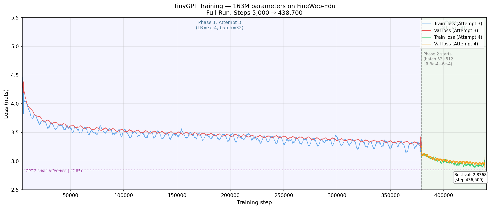

# TinyGPT: A 163M Parameter Language Model — Training Story

Training run: April–May 2026 | Dataset: FineWeb-Edu (sample-100BT) | Total steps: ~438,700 | Hardware: RTX 4090 on RunPod

---

## The Result

After four set of training attempts spanning couple of months, TinyGPT reached a best validation loss of **2.8368** (perplexity 17.1) — matching Karpathy's nanoGPT reproduction of GPT-2 small, the canonical benchmark for this model class.

| Parameter | Value |
|---|---|
| Architecture | GPT-2 (decoder-only Transformer) |
| Parameters | **163.04M** (162.9M decayed + 125K non-decayed) |
| Layers | 12 |
| Attention heads | 12 |
| Embedding dimension | 768 |
| Context length | 1,024 tokens |
| Vocabulary | GPT-2 tokenizer (50,257 tokens) |
| Dataset | HuggingFaceFW/fineweb-edu (sample-100BT) |
| Attention | Flash attention (scaled dot-product) |
| Precision | bfloat16 |

---

## The Two Lessons That Mattered

Two variables decided the outcome of every training attempt. Everything else was secondary.

**Dataset size.** The first two attempts both hit hard ceilings — not because the model stopped learning, but because the training data ran out. Switching to a 100-billion-token stream immediately unlocked sustained learning that neither earlier run achieved.

**Effective batch size.** Attempt 3 spent 379,000 steps grinding from val loss ~3.92 to ~3.19. Attempt 4 spent 60,000 steps — with 16× the batch size — and improved by more than Attempt 3 did in its final 300,000 steps. Larger batches produce more reliable gradient estimates. More reliable estimates produce more consistent learning.

---

## All Attempts at a Glance

| Attempt | Steps | Dataset | Eff. Batch | LR | Best Val Loss | What stopped it |
| --- | --- | --- | --- | --- | --- | --- |
| 1 | ~60K | Offline curated corpus | 16 | 1e-5 | ~3.64 | Dataset exhausted; LR too low |
| 2 | 100K | FineWeb-Edu 10BT (~2.5 GB), offline | 32 | 3e-4 | **3.34** (step 99.4K) | Run hit 100K step limit; still declining |
| 3 | 379,400 | FineWeb-Edu 100BT, streaming | 32 | 3e-4 | **3.1878** (step 376K) | Gradient noise from small batch |
| 4 | 59,600 | FineWeb-Edu 100BT, streaming | 512 | 6e-4 | **2.8368** (step 436.5K) | Matched benchmark; training stopped |

---

## A Note on Attempt Numbering

This document covers Attempt 3 and Attempt 4 in detail. There were two earlier runs:

- **Attempt 1** (~60K steps total): resumed from a prior training run (attempt-0) with LR=1e-5 — an extremely conservative rate for a 163M model. By the time this notebook picked it up, val loss was already at ~3.64 and essentially flat. The tiny LR meant any further descent was negligible. The dataset (a smaller curated corpus) had run dry. Final stall: ~**3.6**.
- **Attempt 2** (100K steps): fresh start on FineWeb-Edu 10BT (~2.5 GB), offline, with LR=3e-4 and effective batch=32. Val loss fell to 4.03 by step 10,000, then ground slowly down — 3.70 by step 30,000, 3.51 by step 50,000, reaching a minimum of **3.34** at step 99,400. The run ended at the 100K step limit with val 3.4164; loss was still very slowly declining at the cutoff. Final: ~**3.4**.

The key lesson from both: **dataset size was the bottleneck, not the architecture or training recipe.** Both runs hit hard ceilings not because the model stopped learning, but because the data ran out before it did. Switching to [FineWeb-Edu](https://huggingface.co/datasets/HuggingFaceFW/fineweb-edu) (sample-100BT) — a full 100-billion-token stream — immediately unlocked sustained learning for a full 600k-step run. Attempt 3 is where the real training story begins.

---

## Phase 1 — Cold Start (Attempt 3)

Steps 1 → 379,400 | LR = 3e-4 | Effective batch = 32 | ~12.4B tokens seen

Training began from random initialization in April 2026. Hyperparameters were conservative:

| Setting | Value |
|---|---|
| Learning rate | 3e-4 |
| Effective batch size | 32 sequences (2 accumulation steps × 16 micro-batch) |
| Tokens per step | 32 × 1,024 = **32,768** |
| LR schedule | Linear warmup (4,000 steps) → Cosine decay to 3e-5 |

### The Fast Descent (Steps 1–10,000)

The model learned the basics of language almost immediately. Starting from random weights, it dropped to **~3.92** within the first 10,000 steps. This is the phase where the model learns word co-occurrence, basic grammar, and common phrases.

| Step | Val loss | Perplexity |
|---|---|---|
| 1,000 | 6.10 | ~445 |
| 2,000 | 5.36 | ~213 |
| 5,000 | ~4.15 | ~63 |
| 10,000 | ~3.92 | ~50 |

### The Long Crawl (Steps 10,000–379,000)

After the initial steep descent, progress slowed to a crawl. The model spent the next **369,000 steps** — over 97% of the first run — inching from val loss ~3.92 down to ~3.30. Loss was still falling — but barely. This pattern matches what was seen in Attempt 2: after the fast early drop, each additional 4,000 steps bought only ~0.2 nats of improvement, with high variance masking real progress.

Average val loss by phase (5k-step windows):

| Step range | Avg val loss | Change |
|---|---|---|
| 5k–30k | ~3.65 | −0.50 |
| 30k–100k | ~3.56 | −0.09 |
| 100k–200k | ~3.47 | −0.09 |
| 200k–300k | ~3.40 | −0.07 |
| 300k–379k | **~3.32** | −0.08 |

**Why so slow?** The culprit was the small effective batch size. With only 32 sequences per step (32,768 tokens), each gradient estimate was noisy. The model was learning, but each update step was less reliable — two steps forward, one step back. The val loss curve in this phase had high variance, and the model spent enormous compute essentially spinning in place.

The best val loss achieved in Phase 1 was **3.1878** at step 376,000. This checkpoint was saved and became the starting point for Phase 2.

---

## Phase 2 — Breaking the Plateau (Attempt 4)

Steps 379,100 → 438,700 | LR = 6e-4 | Effective batch = 512 | ~31.2B tokens seen

Phase 2 began in May 2026, resuming from the step-379,000 checkpoint with two key changes:

| Setting | Attempt 3 | Attempt 4 | Change |
|---|---|---|---|
| Learning rate | 3e-4 | **6e-4** | 2× |
| Effective batch size | 32 | **512** | 16× |
| Tokens per step | 32,768 | **524,288** | 16× |
| Accumulation steps | 2 | 32 | 16× |

The LR increase follows the linear scaling rule: doubling the batch size warrants doubling the LR (a conservative choice here, where batch went up 16×, but staying at 2× LR is the safer option mid-training).

### Immediate Acceleration

The effect was visible within the first few thousand steps. The val loss, which had been hovering around 3.10–3.30 for hundreds of thousands of steps, began falling cleanly:

| Step | Val loss | Perplexity |
|---|---|---|
| 379,100 (start) | 3.09 | ~22.0 |
| 395,000 | 2.95 | ~19.1 |
| 410,000 | 2.95 | ~19.1 |
| 420,000 | 2.93 | ~18.8 |
| 430,000 | **2.88** | ~17.8 |
| 436,500 | **2.8368** | **17.1** |

In just **59,600 steps**, the model improved by ~0.26 nats — more than Phase 1 achieved in its final *300,000 steps*. The larger batch meant each gradient step was a far more reliable estimate of the true loss gradient, and the model responded accordingly.

### The Final Numbers

Training was stopped at step **438,700**. Having crossed the nanoGPT GPT-2 small benchmark (val loss ~2.85), it was a logical stopping point — the model had demonstrated it matched the reference quality, and spending additional GPU cycles for incremental gains was not justified.

| Metric | Value | Step |
|---|---|---|
| Best validation loss | **2.8368** | 436,500 |
| Best training loss | **2.6744** | 436,700 |
| Final val loss (last point) | 2.9–3.07 (noisy) | 438,700 |
| Best perplexity | **~17.1** | 436,500 |

The train/val gap remained narrow (~0.05–0.10) throughout Phase 2, confirming no overfitting.

---

## Where the Model Landed

### vs. GPT-2 (the Reference)

The canonical benchmark for this model class is Karpathy's **nanoGPT reproduction of GPT-2 small (124M parameters)**, which achieves approximately **val loss ~2.85** on OpenWebText — a perplexity of ~17.3.

TinyGPT (163M, fineweb-edu) reached **val loss 2.8368 / perplexity 17.1** — effectively matching or slightly beating the GPT-2 small reference.

Two important caveats:
1. TinyGPT has **163M parameters vs. 124M** for GPT-2 small — a ~31% larger model, so a slight edge is expected.
2. The datasets differ: fineweb-edu is a filtered, higher-quality educational subset of Common Crawl, while OpenWebText mirrors Reddit-curated web text. Educational text is somewhat more structured and predictable, which typically yields lower perplexity, so the numbers are not directly comparable.

### Total Tokens Processed

| Phase | Steps | Tokens/step | Total tokens |
|---|---|---|---|
| Attempt 3 | 379,400 | 32,768 | ~12.4B |
| Attempt 4 | 59,600 | 524,288 | ~31.2B |
| **Total** | **439,000** | — | **~43.6B** |

For a 163M parameter model, the Chinchilla-optimal training budget is roughly 163M × 20 ≈ **3.3B tokens**. TinyGPT was trained on ~43.6B tokens — about **13× over-trained** relative to the compute-optimal point. This is actually a good thing for inference: an over-trained smaller model is cheaper to run than a larger model at the compute-optimal point, while achieving similar loss.

---

## What Would Have Happened

At stop time (step 438,700), training was **73% through the cosine decay schedule** (target: 600,000 steps). The learning rate had decayed from its peak of 6e-4 to approximately **~1.0×10⁻⁴**, with the schedule still heading down to 6e-5 by step 600k.

The model was still actively learning — new val loss lows were being set in the final 10k steps before the run ended. Had training continued to completion:

- The cosine tail (steps 438k→600k) would have provided ~161k more steps of refined learning at slowly decreasing LR.
- Projected final val loss: approximately **2.78–2.83**.
- Estimated final perplexity: **~16.1–16.8**.

---

## Key Takeaways

1. **Batch size matters more than steps.** Phase 1 spent 379k steps and achieved val loss 3.19 minimum. Phase 2 spent 60k steps with 16× the batch and surpassed that by 0.35 nats. Each Phase 2 step processed 16× more tokens and produced 16× more reliable gradient estimates.

2. **Small batch training is self-defeating at scale.** With batch=32 on a 163M model, the gradient noise-to-signal ratio was high enough that hundreds of thousands of steps were mostly canceling each other out. Scaling the batch to 512 resolved this immediately.

3. **The model was still learning when stopped.** There is no sign of plateau or diminishing returns at the point training was halted — a continuation to 600k steps would have improved the model further.

4. **Dataset size is the first thing to get right.** Attempts 1 and 2 hit hard ceilings at ~3.6 and ~3.4 respectively simply because the training data ran out before the model did. No amount of hyperparameter tuning fixes an undersized dataset. Switching to FineWeb-Edu (100B tokens) immediately unlocked sustained, long-run learning.

5. **163M parameters on educational text, trained well past Chinchilla-optimal, matches GPT-2 small quality.** That is a solid result for a from-scratch implementation built and iterated incrementally across four attempts.

---

*Implementation: custom PyTorch. Dataset: FineWeb-Edu via HuggingFace streaming. Hardware: RTX 4090 on RunPod.*
